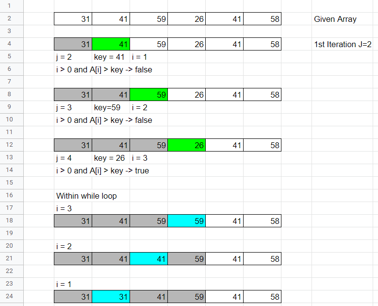
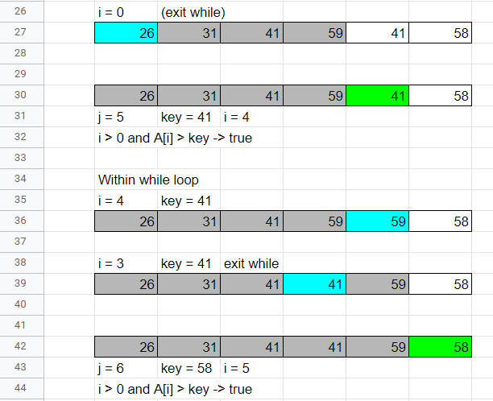
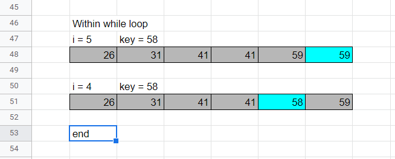

## Using Figure 2.2 as a model, illustrate the operation of INSERTION-SORT on the array A {31; 41; 59; 26; 41; 58}.


The following diagramans follows:
```
for j = 2 to A.length 
    key = A[j] 
    // Insert A[j] into the sorted sequence A[1..j-1]
    i = j - 1 
    while i>0 and A[i] > key 
        A[i + 1] = A[i]
        i = i - 1 
    A[i + 1] = key
```








